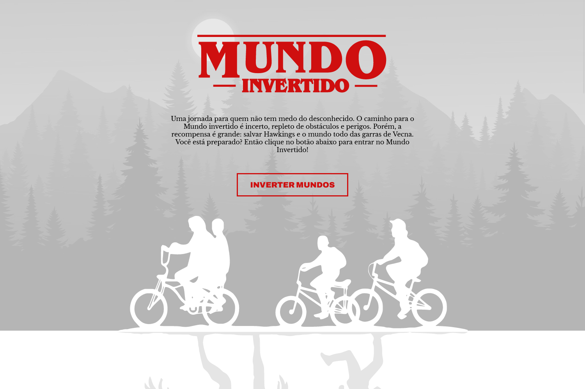

# Semana Mundo Invertido - DIO

> Sobre

Página desenvolvida na semana DIO Mundo invertido, onde a aplicação abordada foi criar uma página sobre o Stranger Things. Nesse desenvolvimento foi possível aprender e revisar diversos conceitos e tecnologias, como os listados abaixo:

## 🛠 Tecnologias
- HTML
- CSS
- JavaScript
- Git
- Github

## 💬 Assuntos abordados
- HTML
    - Estruturação da página 
    - Semântica
    - Acessibilidade
    - Web Scraping
    - SEO
- CSS
    - Posicionamentos
    - Pseudo-elementos
    - Pseudo-classes
    - Flexbox
    - Animações 
- JavaScript
    - Introdução ao JavaScript
    - Manipulação do DOM
    - Introdução ao Firebase
    - Integração com o Firebase

## 💻 Contato 

 > kennylima@hotmail.com